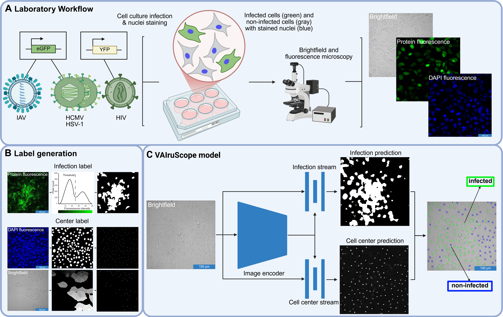
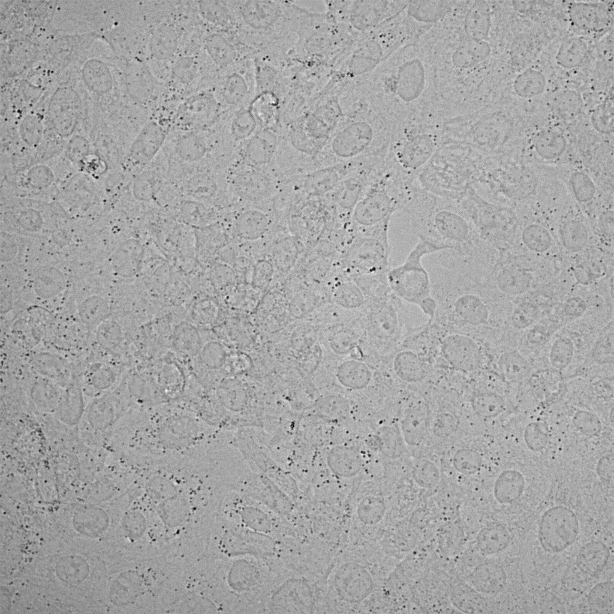
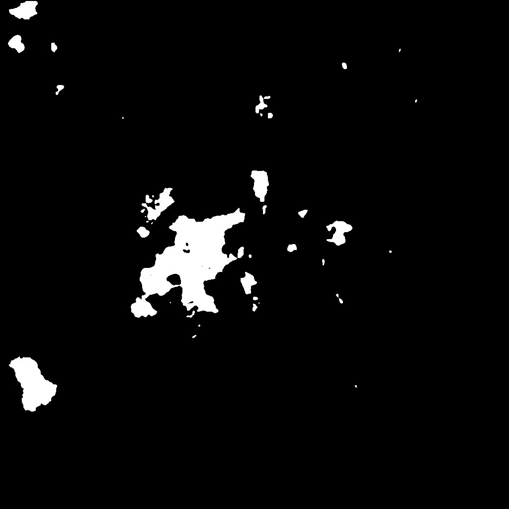
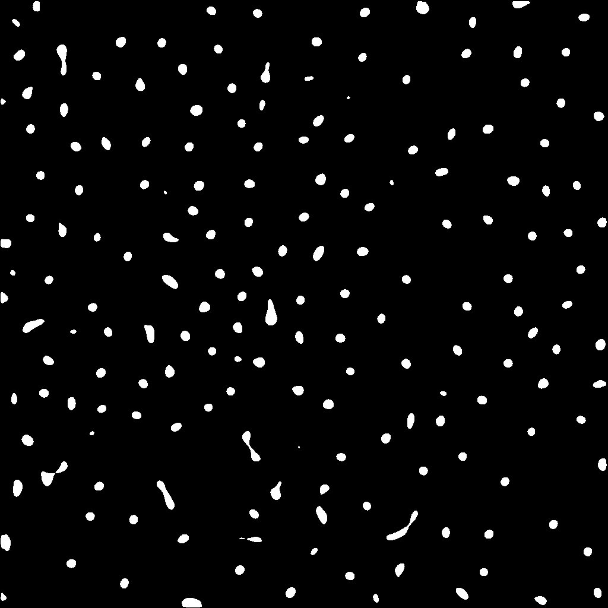
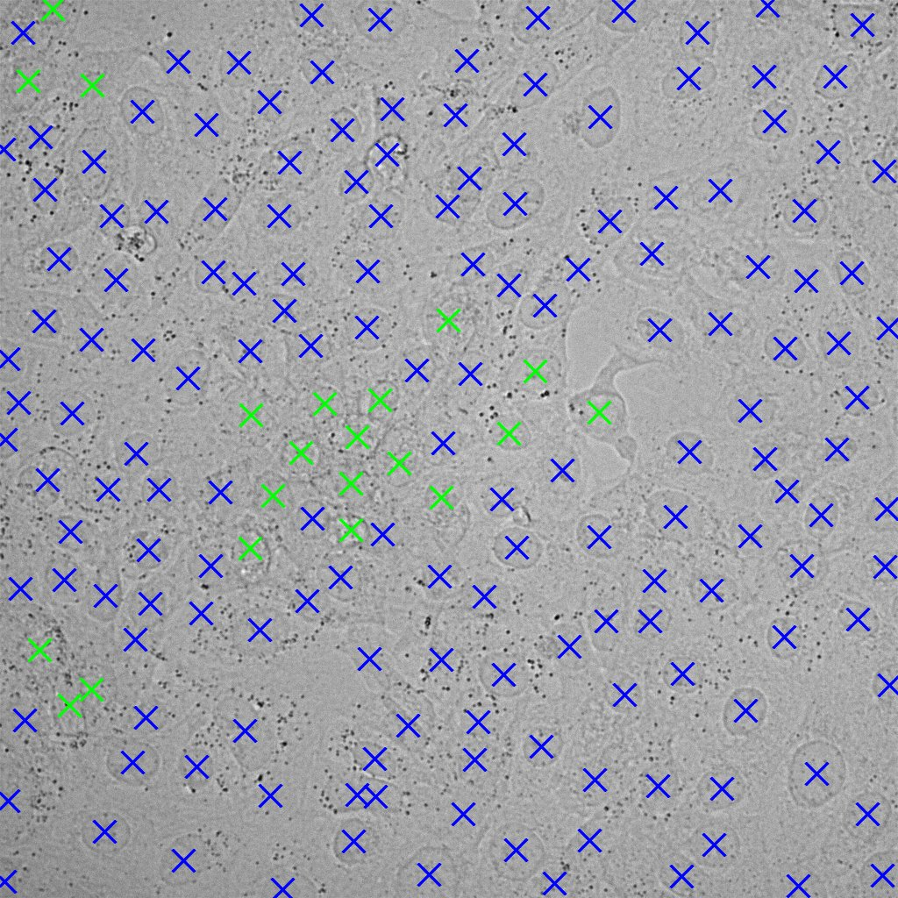

# Label-free detection of individual virus-infected cells using deep learning 

This repository provides the inference pipeline for VAIruScope, a deep learning framework for the label-free detection of virus-infected cells from light microscopy images.



The pipeline takes brightfield or phasecontrast images as input and predicts:
- cell locations
- infection status for each cell
The model weights were trained as described in the accompanying manuscript.

## Installation

Clone the repository and install dependencies:
```bash
git clone https://github.com/ZKI-PH-ImageAnalysis/VAIruScope.git
cd VAIruScope
conda env create -f env.yml
conda activate VAIruScope
pip install torch==2.5.1 torchvision==0.20.1 --index-url https://download.pytorch.org/whl/cu121
```

## Patch the UperNet model
Due to modifications required for our architecture, the default `UperNetForSemanticSegmentation` implementation in HuggingFace Transformers must be replaced.
- open /.conda/envs/VAIruScope/lib/python3.9/site-packages/transformers/models/upernet/modeling_upernet.py
- replace the class `UperNetForSemanticSegmentation` with the implementation provided in: model.py

## Inference

Update directories in `inference.py` and run `python inference.py` to start prediction.

Update directories in `classify_cells.py` and run `python classify_cells.py`

## Output

After running the pipeline, the following output directories are created:

```text
VAIruScope/
│
├── inference/ #raw model inference output (predicted infection and center masks)
│   ├── image1_infection.tif
│   ├── image1_center.tif
│   └── ...
├── pred_infection/ #images with predicted infected/non-infected cells
│   ├── image1.tif
│   ├── image2.tif
│   └── ...
```

## Example images

This repository includes a small set of example microscopy images to demonstrate the inference pipeline.
The images are located in:

```text
example_images/
├── image1.tif
├── image2.tif
└── ...
```

Below is an example showing the original image, the predicted infection and center mask and the final output with the detected cells and their infection status overlaied on the brightfield image (blue crosses = non-infected, green crosses = infected).

<table>
<tr>
<td align="center">original image</td>
<td align="center">infection mask</td>
<td align="center">cell center mask</td>
<td align="center">final prediction</td>
</tr>

<tr>
<td></td>
<td></td>
<td></td>
<td></td>
</tr>
</table>

## Citation

```
@article{pfeil2026label,
  title={Label-free detection of individual virus-infected cells using deep learning},
  author={Pfeil, Juliane and Siegmund, Corinna and Mueller, Eva and Akhmedova, Shakhnaz and Loewe, Alexandra and Kauter, Anne and Tertel, Tobias and Giebel, Bernd and Laue, Michael and Le-Trilling, Vu Thuy Khanh and Sieben, Christian and Trilling, Mirko and Schwarzer, Roland and Körber Nils},
  journal={bioRxiv},
  pages={2026--01},
  year={2026},
  publisher={Cold Spring Harbor Laboratory}
}
```

[Paper on bioRxiv](https://www.biorxiv.org/content/10.64898/2026.01.15.699499v1)


